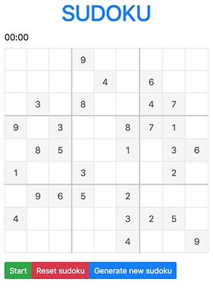

# Javascript Sudoku

[](https://github.com/denissdubinin/javascript-sudoku)

Javascript plugin that generates random sudoku grid.



## Demo

https://denissdubinin.github.io/javascript-sudoku/

## Installation

### CDN
1. Add a sudoku script to your page:
    
    ```html
    <script src="https://cdn.jsdelivr.net/gh/denissdubinin/javascript-sudoku@latest/dist/sudoku.min.js"></script>
    ```

2. Add a sudoku stylesheet to your page:

    ```html
    <link rel="stylesheet" href="https://cdn.jsdelivr.net/gh/denissdubinin/javascript-sudoku@latest/dist/sudoku.min.css">
    ```

### Local files
1. Add a sudoku script to your page:
    
    ```html
    <script src="PATH_TO_DIR/sudoku.min.js"></script>
    ```

2. Add a sudoku stylesheet to your page:

    ```html
    <link rel="stylesheet" href="PATH_TO_DIR/sudoku.min.css">
    ```

## Usage

1. Create `div` element on your page:

    ```html
    <div></div>
    ```

2. Initialise Sudoku plugin:
    
    ```javascript
    $(element).Sudoku();
    ```

3. Custom control buttons

    You can use custom buttons for sudoku. To disable default buttons, set options `useCustomButtons` to `true`.

    For custom buttons use `ID` selector:

    * `start-sudoku` for start button
    * `r-sudoku` for reset button
    * `gn-sudoku` for generate button

    Example:

    ```html
    <div class="button" id="start-sudoku">START</div>
    <div class="button" id="r-sudoku">RESET</div>
    <div class="button" id="gn-sudoku">GENERATE NEW SUDOKU</div>
    ```

# Example

```javascript
$(element).Sudoku({
    dropTimerOnReset: true,
    markWrongCellsOnFly: false,
    useTimer: true,
    timerOnly: true,
});
```

## Options

`squareSize`

Size of small squre. Default `3`

`dropTimerOnReset`

Reset timer on sudoku reset. Default `true`

`markWrongCellsOnFly`: false,

Mark cell with red if it has wrong value right after number is entered. Default `false`

`markWrongCellsOnFinish`

Mark cell with wrong value with red when all cells are filled. Default `true`

`useTimer`

Enable timer. Default `true`

`timerOnly`

Game can be started only with activated timer. Works only with `options.useTimer === true`. Default `true`

`useCustomButtons`

If you want to use own control buttons, enable this options. Default `false`

`sudokuMixIterations`

Iterations count for mixing random rows and columns between themselfs The larger number, the more mixed sudoku becomes and the more time script initialisation takes. Default `500`

## Dependencies
jQuery 1.7

## License
Copyright &copy; 2018 Deniss Dubinin

Licensed under the MIT license.